# 项目的运行环境
go version go1.25.0
# 依赖安装步骤
cd task4 && go mod tidy
# 启动方式
在 task4目录下执行: go run main.go
# 测试用例
## 登录

## 注册
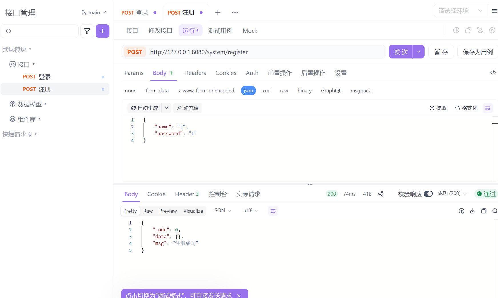

## 博客详情
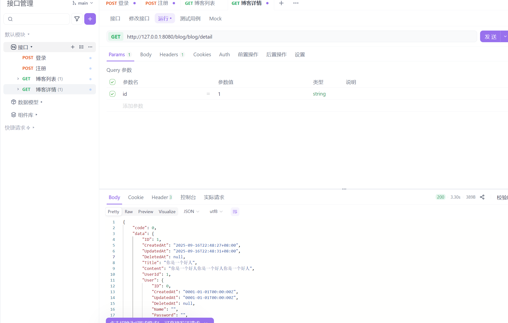

## 博客列表
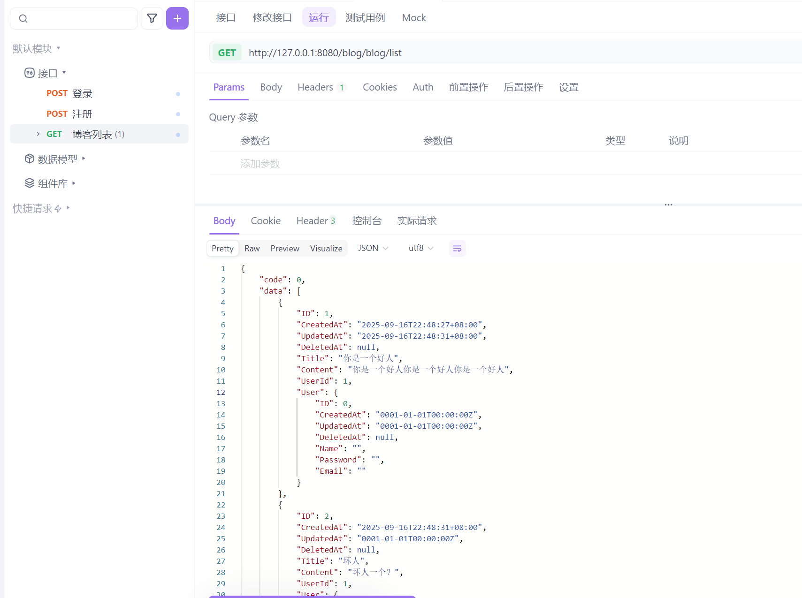

## 创建博客
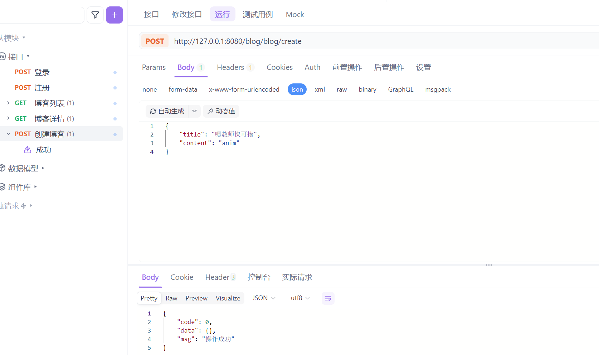

## 修改博客
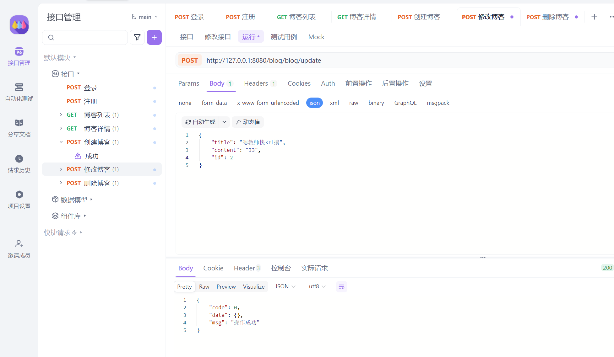

## 修改博客-非自己
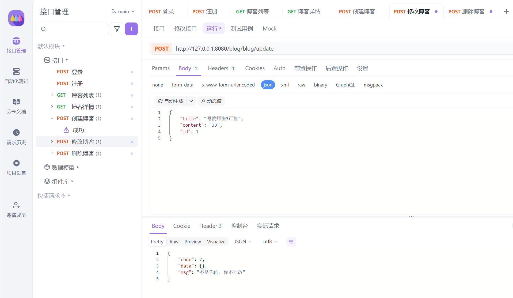

## 删除博客
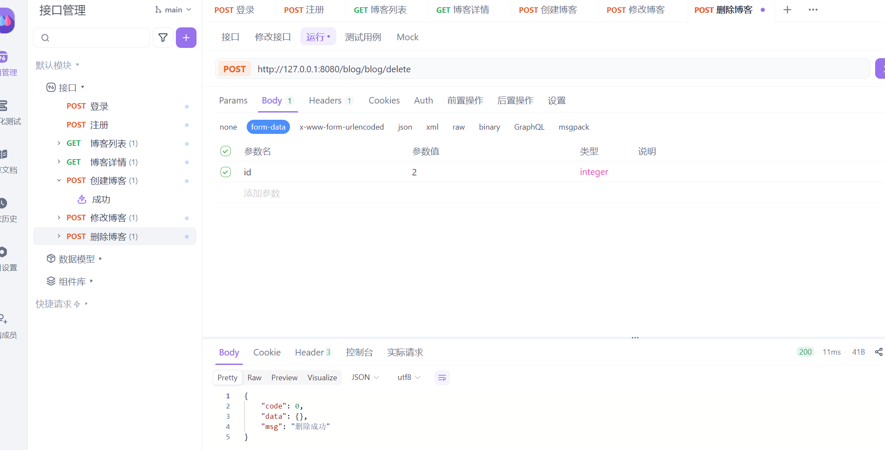

## 删除博客-非自己
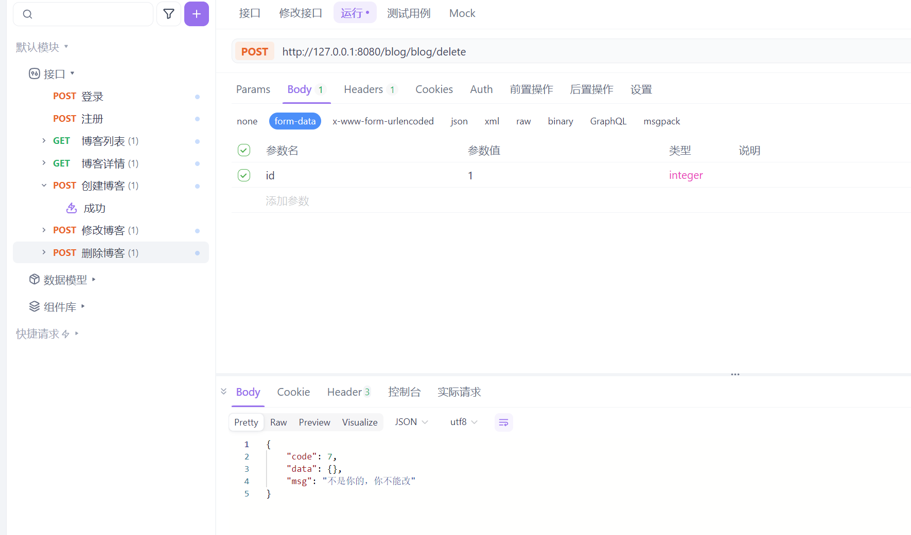

## 创建评论
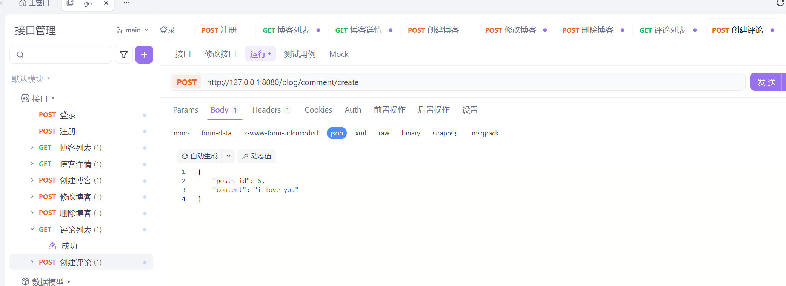

## 评论列表
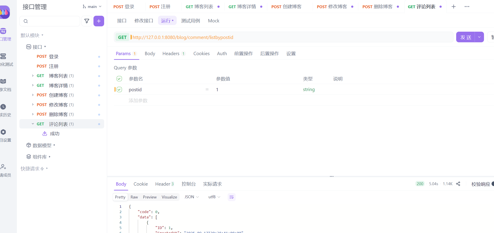

## 无效Token
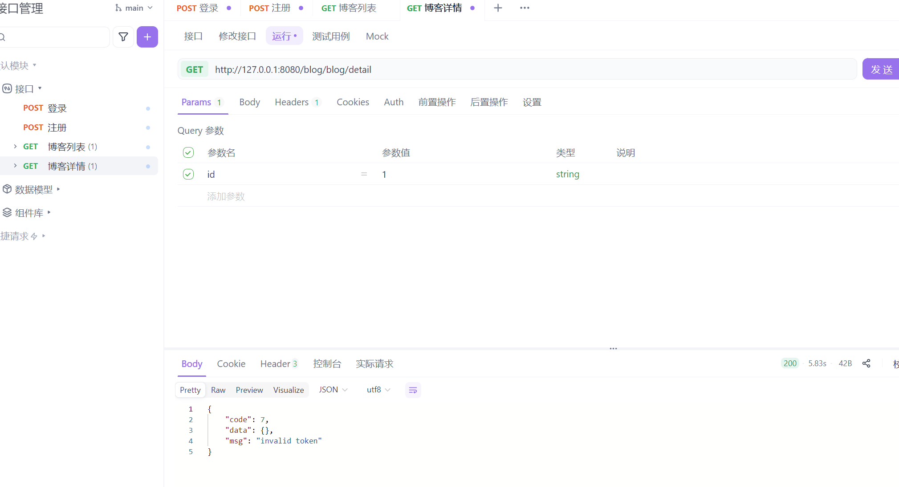